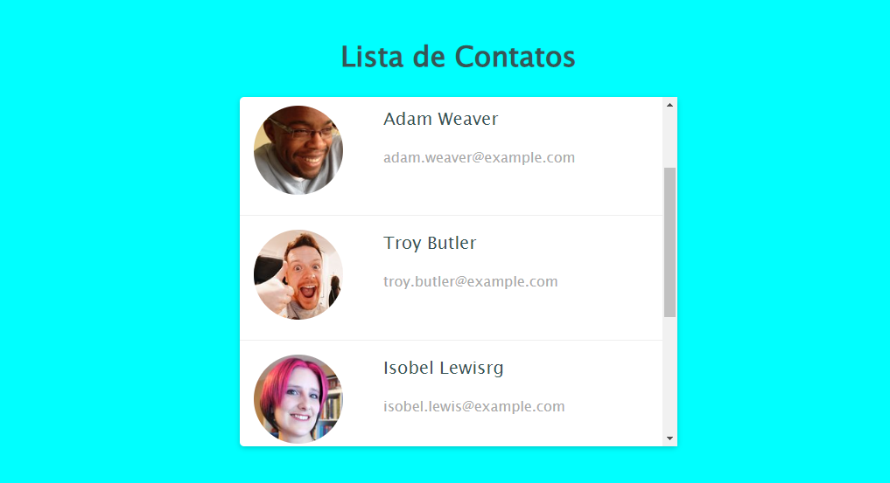

# Projeto-Intermediário-Front-01
O Projeto aqui é do nível <b>Intermediário</b>, utilizando HTML/CSS

 
    
    

#

#01 Lista de Contatos

O projeto simula uma Lista de Contatos, foi construido com ajuda do Professor da SerlivCursos, nele utilizamos:

- flexbox
- as imagens dos cards utilizadas, pertence a URL : https://randomuser.me/
- overflow

Canal da Serliv: https://www.youtube.com/@serliv  
Udemy : https://www.udemy.com/user/serfrontendcursos/

#

    

